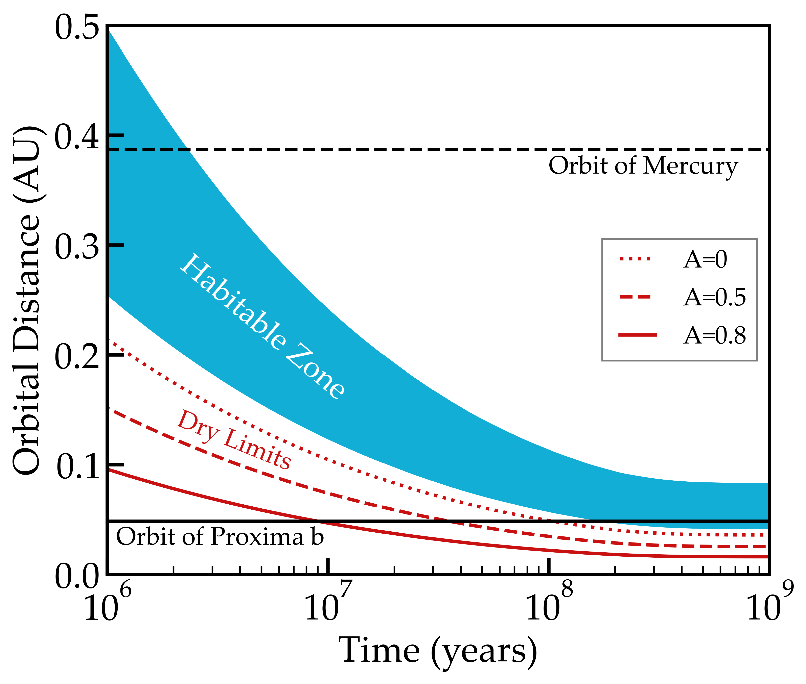

Evolution of Proxima's Habitable Zone
=====================================================================================

Overview
--------

As Proxima Centauri evolves toward the main sequence, its habitable zone (HZ)
limits move inward.

===================   ============
**Date**              29 Jun 2020
**Author**            Rory Barnes
**Modules**           STELLAR
**Approx. runtime**   10 seconds
===================   ============

To run this example
-------------------

.. code-block:: bash

    python makeplot.py < png | pdf >

Expected output
---------------

   Evolution of the HZ of Proxima Centauri. The blue shaded region is bounded by
   the moist greenhouse and maximum greenhouse limits from Kopparapu et al.
   (2013). The "dry limits" are the limits for a water poor planet with albedos
   (A) of 0, 0.5, and 0.8. The semi-major axes of Proxima b and Mercury are also
   shown.
